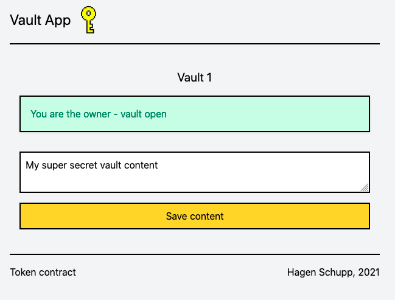

# Vault DApp
DApp to store and retrieve information. The owner of a vault alone is able to access the data.
Ownership of a vault is represented by holding an [ERC-721 (NFT)](https://ethereum.org/en/developers/docs/standards/tokens/erc-721/) token.

Project URL: https://brakid-vault.web.app

The Vault Token contract is deployed to the Polygon Testnetwork: https://mumbai.polygonscan.com/ under address: [0xd9fDD544c7db7a69D87755Cc702dEe49e44c4857](https://mumbai.polygonscan.com/token/0xd9fDD544c7db7a69D87755Cc702dEe49e44c4857)

Each vault stores data that the vault owner can access only. Access to the data is managed by the backend system: to verify the ownership each read and write request needs to be accompanied with a [signature](https://medium.com/mycrypto/the-magic-of-digital-signatures-on-ethereum-98fe184dc9c7) provided by the wallet owning the NFT for the vault to open. This ensures that the call to read or write data is done by the NFT owner only (assuming the NFT owner does not give away the signature). To avoid using a signature repeatedly by unauthorized perticipants, each signature contains atimestamp that limits the validity of a message to 5 minutes.

## Technologies used:
* React JS with Typescript for the webapp
* Tailwind CSS for styling the webapp
* Solidity & Truffle for the Smart Contracts
* Firebase for hosting and the database
* Golang and Gin for the backend managing the database access
* Ethereum client for Golang to validate the ownership and check the signatures of the system accessing the vault data
* Polygon (Matic) Testnet to deploy and run the NFT Contract
