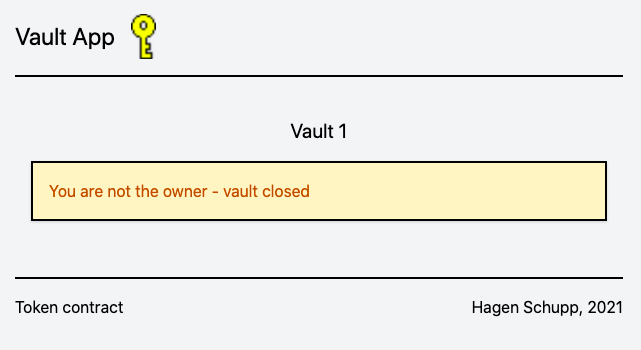

# Vault DApp
DApp to store and retrieve information. The owner of a vault alone is able to access the data.
Ownership of a vault is represented by holding an [ERC-721 (NFT)](https://ethereum.org/en/developers/docs/standards/tokens/erc-721/) token.

Project URL: https://brakid-vault.web.app

The Vault Token contract is deployed to the Polygon Testnetwork: https://mumbai.polygonscan.com/ under address: [0xd9fDD544c7db7a69D87755Cc702dEe49e44c4857](https://mumbai.polygonscan.com/token/0xd9fDD544c7db7a69D87755Cc702dEe49e44c4857)

Each vault stores data that the vault owner can access only. Currentyl the implementation is not safe as it uses Firebase directly in the React app to read and write the data. It is protected by having an owner flag (TODO: switch to own backend that verifies owner identify before each read and write)

## Technologies used:
* React JS with Typescript for the webapp
* Tailwind CSS for styling the webapp
* Solidity & Truffle for the Smart Contracts
* Firebase for hosting and the database
* Polygon (Matic) Testnet to deploy and run the NFT Contract